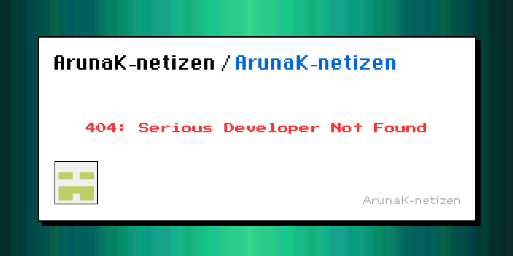

<!-- Banner Section -->

  

<!-- GitHub Snake Game Section -->

  <picture>
    <source media="(prefers-color-scheme: dark)" srcset="https://raw.githubusercontent.com/Arunak-netizen/Arunak-netizen/output/github-snake-dark.svg" />
    <source media="(prefers-color-scheme: light)" srcset="https://raw.githubusercontent.com/Arunak-netizen/Arunak-netizen/output/github-snake.svg" />
    
  </picture>

